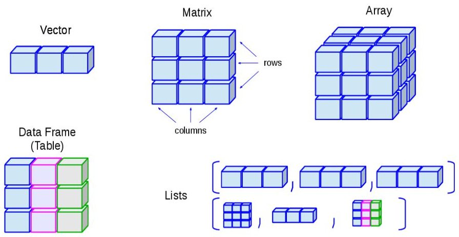

```{r setup, include=FALSE}
knitr::opts_chunk$set(echo = TRUE)
```

## Objective

- Become familiar with R, RStudio, and RMarkdown
- Familiarize with R's data types and data structures (objects)
- How/where to get help to troubleshoot R code

At the end of this section, you should have a better understanding of what R's main data types and how they are stored in data structures. Also, will be able to navigate the RStudio graphic user interface and create RMarkdown documents.

## Introduction to R
### R's history
R is an implementation of the S programming language combined with lexical scoping semantics, inspired by Scheme. S was created by John Chambers in 1976, while at Bell Labs. There are some important differences, but much of the code written for S runs unaltered.

R was created by Ross Ihaka and Robert Gentleman at the University of Auckland, New Zealand, and currently developed by the R Development Core Team (of which Chambers is a member). R is named partly after the first names of the first two R authors and partly as a play on the name of S. The project was conceived in 1992, with an initial version released in 1995 and a stable beta version in 2000. [History of R](https://en.wikipedia.org/wiki/R_(programming_language))

### Generalities
* R is an object-oriented programming language (OOP).
* There is always more than one way to solve a problem (no right or wrong)
* Programming can be fun; play around and see what happens as you change the code. However, it's generally a slow process because of a steep learning curve.
* It is common to feel overwhelmed and thinking that you are wasting your time/too old/not smart enough. Don't let these emotions bring you down; the effort will pay off sooner than you think.
* Swearing at your computer will come naturally as you develop your coding skills. This phenomenon occurs mostly during the first phases right after the individuals are exposed to a programming language. Be aware of who is around.
* Commenting your code usig hashtags is the single best thing you can do for your future self. Otherwise you will probably will not remember why and how you wrote a piece of code. Just to prove this point: What did you have for breakfast last Tuesday? 
* Code trobleshooting: search engines, like DuckDuckGo and Google, are your best friends. Stackoverflow, R Bloggers, and many open-source books avaialble online.


### Scripting in R
Codes in R/RMarkdown scripts are text files and can be viewed as such, i.e. they can be opened in text editors such as Notepad and Word.

### Basics of the RStudio Integrated Development Environment
* R in the command line
* Tour around RStudio
* Packages or libraries: Packages are collections of functions that can be install by demand. Think of them as add-ons.
* Examples of R and RMarkdown scripts.


### Data basics
#### Modes and classes of R objects
R object: Anything that can be assign to a variable for later use.


##### Numbers

```{r}
rm(list=ls(all=TRUE)) # always start with a clean environment


3 # Number 3
mode(3) # Type or storage mode of an object. This tells us how the objects is stored
class(3) # Type of R object
```

##### Character
```{r}
"calgary" # Number 3
mode("calgary")
class("calgary")
```

##### Logical
```{r}
TRUE # also refered as "boolean"
mode(TRUE)
class(TRUE)
```


#### Assigning variables

A main feature of R is its capability to store objects in the environment. However, there are some rules that must be beared in mind when naming variables. Variables cannot 
* start with a number
* Containg special characters such as asterisks, mathematical symbols, and spaces, among others

Additionaly, avoid naming your variables using reserved words such as for, while, and c. These, among many other that we will come across during the workshop, have a specific meaning in R (and in many other programming languages). 

There are several conventions recommended to name variables and functions. You can select any that but the most important aspect is to be consistent,i.e., stick to one naming convention for your variables and customized functions.

##### Naming conventions
* lowerCaseCamel* (functions)
* UpperCamelCase
* period.separated* (variables)
* underscore_separated
* singlelowercaseword
* _OTHER.conventions


#### Data types
###### Numeric
```{r}

c(2, 3, 5, 10)
numeric.object1 <- c(2, 3, 5, 10)
print(numeric.object1) #use the print() function or simply the object's name

numeric.object1
mode(numeric.object1)
class(numeric.object1)
typeof(numeric.object1)

numeric.object2 <- seq(from= 1, to = 10, by=2)
numeric.object2
```

###### Logical
```{r}
logical.object <- c(TRUE,FALSE,TRUE,FALSE,FALSE)
logical.object
mode(logical.object)

```

###### Character
```{r}
character.object <- c("Lake Louise", "Morraine", "Pigeon", "Upper Kananaskis")
character.object
mode(character.object)

```

###### Numeric and logical
````{r}
numeric.logical.object <- c(5, FALSE, 1, 0, TRUE)
numeric.logical.object
mode(numeric.logical.object)
class(numeric.logical.object)
typeof(numeric.logical.object)
```

Notice that the logical elements are automatically transformed into numeric (TRUE = 1 and FALSE = 0). Be careful!


###### Numerical, logical, and character

```{r}
numeric.logical.character.object <- c(TRUE, 18, 2, "data", FALSE)
numeric.logical.character.object # Can you see what is going on?

class(numeric.logical.character.object)

```

Everything gets coerced (forced into) character data

###### Factors 
Another data type in R are factors, which correspond to data with a categorical nature.

```{r}
character.object
is.factor(character.object) # is this a factor? Ouput to this question is logical (TRUE/FALSE)

factor.object <- as.factor(character.object) # Turn character into a factor
factor.object
is.factor(factor.object)
mode(factor.object)
class(factor.object)
```


For vectors, the mode will always be numerical, logical, or character. For matrices and arrays, a class is always matrix or array, but its mode can vary (numerical, logical, or character).

Vectors, arrays, matrices, and data frames will be discussed shortly.


### R objects
We can think of objects as a collection of elements that can be numeric, character, logical, factor, or all of them.

{width=800px} 

#### Vectors
Vectors are one-dimensional objects

```{r, eval=FALSE}
5 # numeric atomic vector (atomic makes reference to being just one element)
d # character atomic vector
c(1,3,4) # numeric vector
```


#### Numeric vectors
```{r}
numeric.vector <- seq(from=1, to=20, by=3)
numeric.vector

mode(numeric.vector)
class(numeric.vector)
is.vector(numeric.vector)
```

##### Mixed vectors
```{r}
mixed.vector <- c(5, 18, "car", 20)
mixed.vector

# We can name the elements too:
named.mixed.vector <- c(element1=5, element2=18, element3="car", element4=20)
named.mixed.vector
```


#### Converting between objects modes

##### Numeric to character
```{r}
numeric.vector <- seq(from=-10, to=10, by=2)
numeric.vector

numeric.to.character <- as.character(numeric.vector)
numeric.to.character
```

##### Numeric to logical
```{r}

numeric.to.logical <- as.logical(numeric.vector)
numeric.to.logical # Everything oher than "0" gets converted into "TRUE"
```

##### Character to numeric

```{r}
character.object
character.vector.1 <- character.object # Create a new object using a pre-existing object
character.vector.1

as.numeric(character.vector.1) # nothing to convert into numbers


character.vector.2 <- c("3", "nine", "4", "1")
character.vector.2
character.to.numeric <- as.numeric(character.vector.2)
character.to.numeric
```


##### Logical to character
```{r}
logical.object
logical.vector <- logical.object
logical.vector

logical.to.character <- as.character(logical.vector)
logical.to.character
```

##### Logical to numeric

```{r}
logical.to.numeric <- as.numeric(logical.vector)
logical.to.numeric #TRUE = 1, FALSE = 0
```


##### Accessing objects in a vector

Vectors can be accessed by indexation using squared brackets
```{r}
character.vector <- character.object

character.vector[1] # Position of the element
character.vector[2:4]

```


#### Matrices

Matrices are our first two-dimensional R object. Matrices are like spreadsheets that store one data type at the time, i.e., all data must be numeric or character but not a combination of them.

```{r}
variable.1 <- c(2,4,6,8)
variable.2 <- c(1,3,5,7)
variable.3 <- c(10,11,12,13)
variable.4 <- character.vector 

matrix.object <- as.matrix(variable.1, variable.2, variable.3, variable.4)

# Let's overwrite "matrix"
matrix.object <- matrix(c(variable.1, variable.2, variable.3, variable.4),
                 nrow = 4, ncol = 4)

class(matrix.object); mode(matrix.object) # the semicolon inidcates that the two pieces of code should be run bact-to-back

```

We can transpose the order of the elements
```{r}

matrix.object ; t(matrix.object)
```


Mathematical operations are possible with matrices:

```{r, error=TRUE}
matrix.object %*% t(matrix.object) # %*% is used for matrix multiplication

# Need a numeric matrix, of course

set.seed(1) # makes possible to reproduce code that involves making pseudorandom numbers 
matrix.object2 <- matrix(rnorm(16), nrow=4, ncol=4)
matrix.object2; t(matrix.object2)

matrix.object2 %*% t(matrix.object2)
```

Matrices can only take one data mode, otherwise everything is converted into character data.


##### Accessing elements of a matrix
```{r}
# Objects looked by column by deafult
matrix.object2[1] # element 1
matrix.object2[4] # element 4
matrix.object2[5] # element 5


matrix.object2[1,2] # row 1, column 2
matrix.object2[4,3] # row 4, column 3

matrix.object2[1:4, 2] # rows 1 to 4, column 2
matrix.object2[1:4, 2:3] # rows 1 to 4, columns 2 to 3
```


#### Data frames
Two dimensional objects, like matrices, but store different types of data just like a spreadsheet. All columns (variables) must have the same length (number of rows).


```{r}
data.frame.object <- as.data.frame(matrix.object) # convert matrix into data frame
data.frame.object
str(data.frame.object)

# All columns have been turned into factors and this can cause troubles. We will discuss this topic laer on.
data.frame.object <- as.data.frame(matrix.object, stringsAsFactors = FALSE)
str(data.frame.object)

```

In R, the columns and rows are called variables and observations, respectively.

Two ways to access elements of a data frame:

1. Using squared brackets.
The syntax to access elements of a data frame is data[rows, columns]

```{r}
data.frame.object[1, 2] # entire variable 1 (column 1)
data.frame.object [ , ] # empty side means "all"
data.frame.object[ , 1] # all observations from variable 1
data.frame.object[ 3, 2] # row 3, column 2

# also can access ranges
data.frame.object[2:3, 2] # observations 2 and 3 from variable 2

```


2. Using a dollar sign ($) to refer to the variable (column) of interest
```{r}
data.frame.object$V2[1] # entire variable 1 (column 1)
data.frame.object$V1 # all observations from variable 1
data.frame.object$V2[3] # row 3, column 2

# also can access ranges
data.frame.object$V2[2:3] # observations 2 and 3 from variable 2
```


#### Arrays
Arrays are multidimensional objects made  up of rows, columns, and slices (think of a rubic cube)

```{r}


# Create an empty array before populating it
array.object <- array(1:24, dim = c(3, 4, 2), #dim indicates rows, columns, sclices
                      dimnames = list(c("observation1", "observation2", "obsevation3"),
                                      c("variable1", "variable2", "variable3", "variable4"),
                                      c("slice1", "slice2"))) 
array.object


# Create an array from vectors
slice1 <- c("calgary", "cat", "tiger", "snow")
slice2 <- c(1, 2, 3, 4)
slice3 <- c(NA, 2, 3, 4)
  
array.object2 <- array(c(slice1, slice2, slice3),
                       dim = c(2, 2, 3))
array.object2

```


Access arrays

```{r, error=TRUE}
array.object[1, 2, 3] # What is going on?

array.object[1, 2, 2]
```


#### Lists

List can store any kind of data and object. List are collections of anything you want.

```{r}
list.object <- list(numeric.object1, 
                    character.object, 
                    data.frame.object, 
                    matrix.object,
                    vector)

list.object[1]
# same as  
list.object[[1]]


list.object[c(2, 3)] # Access character.vector and data.frame.object
```


## Rendering RMarkdown files
